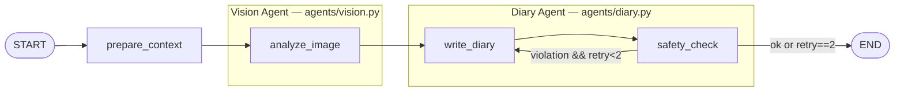

# LangGraph 아키텍처 (ai-gateway)

> 사진 + 키워드 → 1인칭 일기 생성. FastAPI endpoint가 graph를 invoke.
> 소스: `apps/ai-gateway/src/ai_gateway/{graph,state,prompts_loader,contracts}.py`,
> `apps/ai-gateway/src/ai_gateway/agents/{vision,diary}.py`

## 1. 토폴로지

- 컴파일은 `get_diary_graph()` (lru_cache로 1회만 build)
- TypedDict reducer는 **overwrite** — 노드는 변경한 필드만 dict로 반환
- vision/diary는 **모듈로 캡슐화된 2개 Agent**. state는 단일 `DiaryState` 공유.
- retry edge는 `write_diary`로만 돌아감 — 사진 토큰은 vision agent에서 1회만 소비.

## 2. 노드

| 노드 | 모듈 | 책임 | 출력 필드 |
|---|---|---|---|
| `prepare_context` | `graph.py` (inline) | 입력 sanity 훅 (현재 noop, Pydantic 검증으로 충분) | — |
| `analyze_image` | `agents/vision.py` | 사진 → 한국어 시각 묘사 1단락 (객체·자세·표정·배경, 정서 추론 허용) | `vision_description` |
| `write_diary` | `agents/diary.py` | system/user 메시지 조립 → GPT-4o-mini 호출 (text-only) → structured output 파싱 | `diary_text`, `short_caption`, `mood_tag`, `safety_retry_count++` |
| `safety_check` | `agents/diary.py` | 호칭 substring + 길이 검증 | `safety_violation` |
| `should_retry` (conditional edge) | `agents/diary.py` | violation && `safety_retry_count < 2` → `write_diary`, else END | — |

**안전 retry 상한**: `SAFETY_MAX_CALLS = 2` (첫 호출 + retry 1회). 의미는 "write_diary 호출 횟수". state 내부 카운터, DB 영속 X.

## 3. State 스키마 (`DiaryState`)

| 그룹 | 필드 |
|---|---|
| 메타 | `session_id`, `seq` (1~4) |
| 입력 | `pet_id`, `honorific`, `species`, `gender`, `photo_signed_url`, `keywords`, `recent_diaries[≤3]` |
| 재생성 (seq≥2) | `previous_diary_text?`, `regen_feedback?` |
| Vision 산출 | `vision_description?` |
| 출력 | `diary_text?`, `short_caption?`, `mood_tag?` |
| 안전 메타 | `safety_retry_count`, `safety_violation?` |

`vision_description`은 graph 내부 전용 — 응답 body·DB 영속화 모두 X. 재생성 시도 매번 vision agent를 새로 호출 (P1 — 영속화 없는 단순 경로).

## 4. Vision Agent (`agents/vision.py`)

- **모델**: `gpt-4o-mini`, `temperature=0.2` (재호출 간 묘사 흔들림 최소화)
- **Structured output**: `.with_structured_output(VisionAnalysis)`
  - `description: str` 100~600자 (prompt 권장 200~400, Pydantic은 outlier 차단용)
- **메시지**: SystemMessage(`vision_system.md` fill) + HumanMessage([짧은 instruction text + `image_url` (signed URL, `detail="low"`)])
- 싱글톤: `_vision_llm()` (lru_cache)

## 5. Diary Agent (`agents/diary.py`)

- **모델**: `gpt-4o-mini`, `temperature=0.7`
- **Structured output**: `.with_structured_output(DiaryGenerationResult)` — Pydantic으로 schema 강제
  - `diary_text` 50~1000자, `short_caption` 1~100자, `mood_tag` ∈ 7-enum (`행복/신남/평온/졸림/심심/슬픔/까칠`)
- **메시지**: SystemMessage(`system.md` fill) + HumanMessage(text only — 사진 직접 안 봄)
- 싱글톤: `_diary_llm()` (lru_cache)

## 6. 프롬프트 조립 (`prompts_loader`)

소스: `prompts/diary_v1/{vision_system.md, system.md, user_template.md, tone_guide.md}` — import 시 1회 read.

**Vision system 메시지** (`build_vision_system_message`): `vision_system.md` placeholder fill
- `{{ species_raw }}`, `{{ gender }}` — 호칭/톤은 vision 책임 X

**Diary system 메시지** (`build_system_message`): `system.md` placeholder fill
- `{{ tone_common }}` ← tone_guide §0
- `{{ tone_species }}` ← §1(cat) / §2(dog) / §3(other) — `normalize_species()`로 분기
- `{{ species_raw }}`, `{{ gender }}`, `{{ honorific }}`

**Diary user 메시지** (`build_user_message`): 모드 A/B/C 중 1개 선택 후 placeholder fill
- `seq==1` → **A** (신규 생성)
- `seq≥2 && feedback 있음` → **B** (피드백 기반 재생성)
- `seq≥2 && feedback 없음` → **C** (단순 재생성)
- 공통 placeholder: `{{ vision_description }}`, `{{ keywords }}`, `{{ recent_diaries_block }}`
- B/C: `{{ previous_diary_text }}`, B만: `{{ regen_feedback }}`

## 7. 엔트리 (`main.py`)

| Endpoint | seq | 모드 |
|---|---|---|
| `POST /diary/generate` | 1 | A |
| `POST /diary/regenerate` | 2~4 | B / C |

- 미들웨어: `internal_secret_middleware` (outer) → `jwt_middleware` (inner) → endpoint
- `_initial_state(req)`로 DiaryState 빌드 (vision_description 초기값 None) → `graph.invoke(state, config)`
- LangSmith trace config: `metadata={session_id, seq, owner_id_hash(SHA256[:16])}`, `tags=[seq:N]`, `run_name=diary_generate|diary_regenerate`
- 응답은 `DiaryGenerationResult` 3 필드만 (vision_description 비공개)

## 8. 관련 ADR

- ADR-0003: 모델 선택 (gpt-4o-mini Vision)
- ADR-0005: graph 토폴로지 + state schema (부록 — vision/diary 분리 후 갱신 필요)
- ADR-0006: 보안 경계 (`X-Internal-Secret` + Bearer JWT)
- ADR-0010: DB CHECK 길이 제약
- ADR-0011: endpoint 시그니처 + 환경변수
- ADR-0012: LangSmith trace 메타 PII 회피
- ADR-0013: 종 이모지/키워드 매핑
